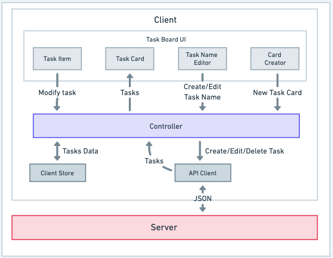

# TaskBoard - System Design

TaskBoard is an intuitive and dynamic web app designed to revolutionize your **task management experience**. Organize **to-do lists** on an expansive dashboard, customize cards, and effortlessly move tasks between them. Enhance **productivity** with **wide-screen** efficiency.

## A. User Problems

Honestly, this project comes from my own problem. When I have **some tasks from multiple different areas**, sometimes it feels so **difficult to manage** or at least to easily get the **overview of all the remaining active tasks**.

I usually write all of my tasks on a **single paper**. I write them in a **big to-do list** and **categorize** them based on the project. However, when I use a plain paper, I always being **distracted** and **urged to write everything** on the paper, **not focusing** on breaking down my tasks & get them done. After that, I will use **another paper** to **rewrite** only my tasks.

However, **it seems doesn't work anymore**. I sometimes **forget on which paper I wrote my to-do lists**. Hence, I tried to take my **post-it notes** and write all of my grouped tasks on some notes. You can imagine there are 5 notes, each of them consists of my to-do lists for Project A, Project B, Study Topic X, Topic Y, and Books to read. This way I could see all of my active tasks being **grouped** using some cards/posts in **different colors**.

I placed a **white wide paper** on the **wall** of my room and put those 5 post-it notes there. The question is, **_what if I am not at home_**? How can I see all of my available tasks when I am outside? Putting those notes on a book feels not OK for me. **I prefer a wide area** (like that white wide paper I used) to easily se**e all of my active tasks**.

## B. Requirements Exploration

### 1. What are the core features to develop?

1. See all tasks grouped on every cards. Hence, I will be able to see those cards on the board.
2. Write a new task on a card.
3. Edit the name of a task.
4. Click on the checkbox of a task to set the status into complete or active.
5. Reorder a task in the same group/card (move it up or down).
6. Move a task to another card.
7. Create a new task board.
8. Edit the name of a task board.
9. See all active & archived task boards.
10. Archive a task board.

### 2. What kind of UX should be used for displaying those tasks?

It would be at most 3 x 2 cards (3 columns & 2 rows). Hence, it will be only 6 cards. However, the user will still be able to see another cards if there are more than 6 cards by doing scrolling vertically to the bottom.

### 3. Will the app be used on mobile devices?

The user prefers wide-screen over small screens (like a mobile phone screen) to easily see all the available tasks. Hence, it will be able to be used only on desktop view (laptop) at the moment. Mobile view will still be developed in the future if it is needed.

## C. Architecture/High-Level Design

### Component Responsiblities

1. **Task Board UI**: displaying cards of tasks
   1. **Task Item**: displaying a task with its name and some buttons to interact (edit name, delete task, reorder the task to move up/down, and move a task to another card).
   2. **Task Card**: displaying the available tasks in a box/card.
   3. **Task Name Editor**: a text input field to enable user to type a name of a task when creating a new one or editing it.
   4. **Card Creator**: a button to create a new task card and displaying a text input field to enable the user to write the card/category name for the tasks.
2. **Client Store**: to store the whole application data that are being used when the app is running.
3. **Controllers**: to manage all user actions (equals to _custom hooks_ in React).
4. **API Client**: to provide an interface for the controller to call functions outside the client-side web app, specifically to create, modify, or delete a task.
5. **Server**: to manage operations outside the client-side web app like storing a new task to the database or retrieving the task from the database to be displayed later on the client-side web app.

## D. Data Model

| Entity       | Source              | Belongs To       | Fields                                                                   |
| ------------ | ------------------- | ---------------- | ------------------------------------------------------------------------ |
| `Board`      | Server              | Task Board UI    | `id`, `name`, `task_groups` (list of `TaskGroup`)                        |
| `TaskGroup`  | Server              | Task Card        | `id`, `name`, `order`, `tasks` (list of `Task`)                          |
| `Task`       | Server              | Task Item        | `id`, `name`, `is_completed`, `order`, `group_id` (FK to `TaskGroup.id`) |
| `NewTask`    | Client (User Input) | Task Name Editor | `name`                                                                   |
| `EditedTask` | Client (User Input) | Task Name Editor | `name`                                                                   |

## E. API Routes

### E.1. Task Board API

1. **Create New Task Board**

   - **HTTP Method**: `POST`
   - **Route**: `/api/boards`
   - **Description**: Create a new task board.

2. **Update Task Boards Name**

   - **HTTP Method**: `PUT`
   - **Route**: `/api/boards/:boardId`
   - **Description**: Update the name of a specific task board.

3. **Fetch Task Boards**

   - **HTTP Method**: `GET`
   - **Route**: `/api/boards?archived=<0/1>`
   - **Description**: Retrieve information about all active and archived task boards.

4. **Archive Task Board**

   - **HTTP Method**: `PUT`
   - **Route**: `/api/boards/:boardId/archive`
   - **Description**: Archive a specific task board.

### E.2. Task Groups API

1. **Fetch All Task Groups in a Board**

   - **HTTP Method**: `GET`
   - **Route**: `/api/boards/:boardId/task-groups`
   - **Description**: Retrieve all task groups (cards) within a specific board.

2. **Create New Task Group**

   - **HTTP Method**: `POST`
   - **Route**: `/api/boards/:boardId/task-groups`
   - **Description**: Create a new task group (card) within a specific board.

3. **Update Task Group Name**

   - **HTTP Method**: `PUT`
   - **Route**: `/api/task-groups/:groupId`
   - **Description**: Update the name of a specific task group (card).

4. **Reorder Task Groups**

   - **HTTP Method**: `PUT`
   - **Route**: `/api/task-groups/reorder`
   - **Description**: Reorder the task groups (cards) within a board.

### E.3. Tasks API

1. **Fetch All Tasks in a Task Group**

   - **HTTP Method**: `GET`
   - **Route**: `/api/task-groups/:groupId/tasks`
   - **Description**: Retrieve all tasks within a specific task group.

2. **Create New Task**

   - **HTTP Method**: `POST`
   - **Route**: `/api/task-groups/:groupId/tasks`
   - **Description**: Create a new task and add it to a specific task group within a board.

3. **Update Task**

   - **HTTP Method**: `PUT`
   - **Route**: `/api/tasks/:taskId`
   - **Description**: Update the details of a specific task, such as its name, completion status, order, or group ID to move it to another task group.

4. **Delete Task**

   - **HTTP Method**: `DELETE`
   - **Route**: `/api/tasks/:taskId`
   - **Description**: Delete a specific task.

5. **Reorder Task Within the Same Group/Card**

   - **HTTP Method**: `PUT`
   - **Route**: `/api/tasks/:taskId/reorder`
   - **Description**: Reorder a task within the same task group.

## F. User Experience

### F.1. Skeletons

When Task Board page is **initially being rendered**, the **components** will be displayed as **skeletons** until the data is **ready** to be displayed.

### F.2. Optimistic Updates

When a user **submits a new task**, it will be **immediatelly displayed** on the UI (**_optimistic updates_**). If the **HTTP request fails**, the UI will be **reverted** (the new task will be removed from the UI) and an **error message** will be displayed.

The **same rules** applies to when a user **modifies a task** (e.g. set as completed, rename the task, reorder it, or move it to another task group/card).

### F.3. User actions when submitting a new task or renaming it

A task name **shouldn't be more than 1 line**. Hence, when user hits **Enter** on the keyboard, the new task will immediatelly being submitted - i.e. browser will make an HTTP request. The **same rules** applies to when a user is **renaming a task**.

### F.4. Handle when there are many tasks in a single group/card

The height of each Task Card component would be fixed, no more than 40% of the viewport height. Hence, the user needs to do vertical scrolling on the card to see all available task items.

### F.5. Micro-interactions

- When a task is deleted, it will be removed from the UI with a smooth animation (fade out or shrinking).
- When a task is completed, the text UI changes (being _italic_ and ~~_strikethrough_~~) will be displayed in a smooth transition. A box shadow will also be displayed on the box in a short period of time.

## G. Technology Stack

1. **Front-end**: NextJS 13, Tailwind CSS, Redux-Toolkit, React Beautiful DnD, React Toastify, React Icons, Jest, and React Testing Library.
2. **Back-end**: Next JS API Routes, Prisma, Sqlite, and Jest.
3. **Development Tools**: ESLint, Prettier, and Husky.
4. **Deployment**: Vercel.

## H. Development Tools

The development tools used for this project are:

1. [ESLint](https://eslint.org/) - A tool for identifying and reporting on patterns found in ECMAScript/JavaScript code.
2. [Prettier](https://prettier.io/) - An opinionated code formatter.
3. [Husky](https://typicode.github.io/husky/#/) - A tool that makes it easy to use githooks as if they are npm scripts.
4. [React Testing Library](https://testing-library.com/docs/react-testing-library/intro/) - A library for testing React components.
5. [Jest](https://jestjs.io/) - A JavaScript testing framework.
6. [Postman](https://www.postman.com/) - A collaboration platform for API development.
7. [Figma](https://www.figma.com/) - A vector graphics editor and prototyping tool.

## I. UI Design

